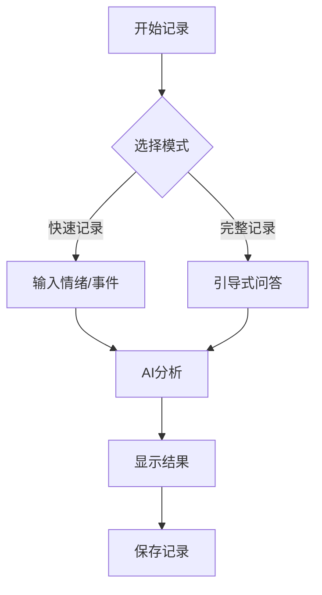

# EchoMind 应用设计文档

## 1. 产品概述

EchoMind是一款心理成长辅助应用，通过AI分析和认知行为疗法（CBT）原理，帮助用户记录情绪、识别思维模式、提供个性化建议，并通过练习系统促进心理健康成长。

## 2. 架构设计

### 2.1 整体架构
- **前端**：React Native 跨平台应用
- **状态管理**：Redux Toolkit
- **本地存储**：AsyncStorage
- **AI服务集成**：可配置的AI API接口（支持本地/远程服务）

### 2.2 核心模块划分

| 模块 | 主要职责 | 文件位置 |
|------|---------|----------|
| 日记系统 | 情绪记录、扭曲识别、AI分析 | src/screens/DiaryWizardScreen.tsx |
| 数据统计 | 情绪统计、趋势分析、可视化 | src/screens/StatsScreen.tsx |
| 个人说明书 | 用户特征管理、自我认知 | src/screens/PersonalProfileScreen.tsx |
| 练习系统 | CBT练习库、进度追踪 | src/screens/ExercisesScreen.tsx |
| 主题定制 | 界面风格、暗色模式 | src/themes/ |

## 3. 功能设计

### 3.1 日记系统设计

#### 3.1.1 核心流程


#### 3.1.2 数据结构
```typescript
interface DiaryEntry {
  id: string;
  date: string;
  emotion: string;
  intensity: number;  // 1-10
  event: string;
  thoughts: string;
  distortions: string[];
  alternativeThoughts: string[];
  aiAnalysis: {
    summary: string;
    suggestions: string[];
  };
  tags: string[];
}
```

#### 3.1.3 页面组件
- DiaryWizardScreen: 引导式记录流程
- DiaryDetailScreen: 查看/编辑单条记录
- DiaryListScreen: 记录列表与筛选

### 3.2 数据统计与可视化设计

#### 3.2.1 核心统计维度
- 情绪分布图表（饼图）
- 情绪趋势图（折线图）
- 思维扭曲类型统计（柱状图）
- 记录频率热图

#### 3.2.2 数据计算逻辑
- 日/周/月/年统计切换
- 情绪强度平均值计算
- 扭曲类型频率排序
- 趋势变化百分比计算

#### 3.2.3 页面组件
- StatsScreen: 主统计页面
- StatsChart: 可复用图表组件

### 3.3 个人说明书系统设计

#### 3.3.1 核心功能
- 个人特征管理（优势、挑战、触发因素）
- 应对策略库
- 自我认知问答
- 个性化建议生成

#### 3.3.2 数据结构
```typescript
interface PersonalProfile {
  strengths: string[];
  challenges: string[];
  triggers: string[];
  copingStrategies: {
    title: string;
    description: string;
    effectiveness: number;  // 1-5
  }[];
  personalityTraits: string[];
  aiGeneratedInsights: string[];
}
```

#### 3.3.3 页面组件
- PersonalProfileScreen: 个人说明书主页面
- QuestionAnswerScreen: 问答交互页面
- CustomQuestionScreen: 自定义问题管理

### 3.4 AI分析系统设计

#### 3.4.1 分析功能
- 情绪识别与分类
- 思维扭曲模式识别
- 替代思维建议生成
- 个性化心理健康建议

#### 3.4.2 AI调用接口设计
```typescript
interface AiService {
  analyzeDiaryEntry(entry: Partial<DiaryEntry>): Promise<AiAnalysisResult>;
  generateAlternativeThoughts(thought: string, emotion: string): Promise<string[]>;
  analyzePersonality(profile: Partial<PersonalProfile>): Promise<string[]>;
  generateExerciseRecommendations(entries: DiaryEntry[]): Promise<string[]>;
}
```

#### 3.4.3 本地缓存策略
- 分析结果本地缓存7天
- 定期清理过期数据
- 批量分析优化

### 3.5 练习库系统设计

#### 3.5.1 练习分类
- 情绪调节练习
- 认知重构练习
- 正念冥想练习
- 自我关怀练习

#### 3.5.2 数据结构
```typescript
interface Exercise {
  id: string;
  title: string;
  category: string;
  duration: number;  // 分钟
  description: string;
  steps: string[];
  frequency: 'daily' | 'weekly' | 'custom';
  recommendedFor: string[];  // 推荐的情绪/情况
}

interface ExerciseProgress {
  exerciseId: string;
  completedCount: number;
  lastCompleted: string;
  streak: number;
  effectiveness: number;  // 用户评分 1-5
}
```

#### 3.5.3 页面组件
- ExercisesScreen: 练习列表页面
- ExerciseCard: 练习详情卡片
- QuestionLibraryScreen: 问题库管理

## 4. UI/UX设计

### 4.1 设计原则
- 简洁、温暖的视觉风格
- 无障碍设计（支持深色模式、文字大小调整）
- 直观的导航结构
- 渐进式功能展示

### 4.2 色彩方案
- 主色调：温暖蓝紫色系（#6C63FF）- 代表平静与智慧
- 辅助色：柔和的绿色（#4CAF50）- 代表成长与希望
- 情绪色彩映射：根据情绪类型使用对应的柔和色调

### 4.3 导航结构
```
底部标签导航：
- 首页 (HomeScreen)
- 日记 (DiaryListScreen)
- 统计 (StatsScreen)
- 练习 (ExercisesScreen)
- 我的 (ProfileScreen)
```

## 5. 技术实现细节

### 5.1 本地存储设计
- AsyncStorage用于持久化用户数据
- 定期自动备份机制
- 数据加密存储（敏感信息）

### 5.2 国际化支持
- i18next框架集成
- 支持中英文切换
- 动态文本翻译

### 5.3 状态管理设计
```typescript
// store/slices/diarySlice.ts
export const diarySlice = createSlice({
  name: 'diary',
  initialState: {
    entries: [] as DiaryEntry[],
    currentEntry: null,
    loading: false,
    error: null
  },
  reducers: {
    addEntry: (state, action) => {},
    updateEntry: (state, action) => {},
    deleteEntry: (state, action) => {},
    setEntries: (state, action) => {},
    setCurrentEntry: (state, action) => {}
  }
});
```

### 5.4 性能优化策略
- 组件懒加载
- 图片资源优化
- 数据分页加载
- 批量操作合并

## 6. 测试策略

### 6.1 单元测试覆盖
- 核心业务逻辑测试
- 数据处理函数测试
- 组件渲染测试

### 6.2 UI测试
- 界面响应式测试
- 多平台兼容性测试
- 无障碍功能测试

## 7. 部署与发布策略

### 7.1 版本控制
- 遵循语义化版本规范
- 渐进式功能发布
- A/B测试框架集成

### 7.2 数据同步策略
- 本地优先设计
- 可选的云端备份
- 隐私优先的数据处理

## 8. 风险评估与应对

| 风险 | 影响 | 应对措施 |
|------|------|----------|
| AI分析准确性 | 高 | 人工审核、持续优化模型、用户反馈机制 |
| 性能问题 | 中 | 优化代码、资源管理、缓存策略 |
| 用户隐私安全 | 高 | 端到端加密、本地存储优先、透明隐私政策 |
| 用户粘性 | 中 | 个性化推荐、成就系统、定期更新内容 |