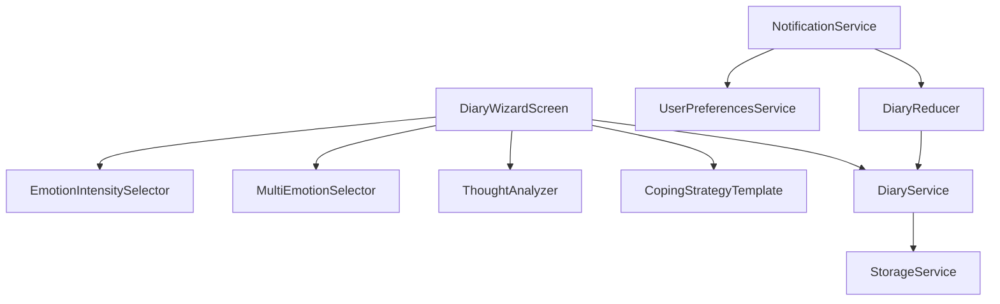

# 日记功能增强设计文档

## 概述

本文档详细描述了EchoMind应用中日记功能增强的技术设计方案。该功能旨在提供更丰富的情绪记录维度、详细的思维分析、应对策略模板和日记提醒系统，以支持用户更全面地了解自己的情绪模式和思维习惯。本设计遵循项目的技术架构和代码规范，确保与现有系统的无缝集成。

## 指导文档一致性

### 技术标准（tech.md）

本设计遵循项目技术架构中定义的分层架构模式：
- 展示层：使用React Native组件实现界面
- 状态管理层：通过Redux Toolkit管理状态
- 服务层：封装业务逻辑
- 数据访问层：与AsyncStorage交互

同时遵循单向数据流原则，保持代码的可维护性和可测试性。

### 项目结构（structure.md）

实现将遵循现有的项目组织结构，主要涉及以下目录：
- `src/screens/`：更新现有日记相关屏幕
- `src/services/`：扩展现有的DiaryService
- `src/store/slices/`：增强日记相关状态管理
- `src/types/`：定义新的数据类型
- `src/components/`：创建新的UI组件

## 代码重用分析

### 现有组件利用

- **DiaryWizardScreen.tsx**：扩展现有日记创建向导，添加新功能
- **DiaryDetailScreen.tsx**：更新以显示增强的数据维度
- **DiaryService.ts**：扩展以支持新的数据模型和操作
- **StorageService.ts**：复用现有存储服务进行数据持久化
- **EmotionChip.tsx**：扩展现有的情绪标签组件以支持多选
- **DistortionChip.tsx**：增强思维扭曲识别组件

### 集成点

- **Redux Store**：与现有日记状态集成，扩展状态结构
- **AsyncStorage**：利用现有存储机制，确保向后兼容
- **UserPreferencesService**：集成以支持提醒设置保存
- **LocalizationService**：确保多语言支持

## 架构

### 模块化设计原则

- **单一文件职责**：每个文件专注于特定功能，如情绪记录、思维分析等
- **组件隔离**：创建小型、专注的组件，如情绪强度选择器、思维扭曲分析器等
- **服务层分离**：将数据访问、业务逻辑和表示层清晰分离
- **工具模块化**：将通用功能封装为独立的工具函数



## 组件和接口

### 1. EmotionIntensitySelector

- **目的**：允许用户选择情绪强度（1-10分）
- **接口**：
  - `onIntensityChange: (intensity: number) => void`
  - `initialIntensity?: number`
- **依赖**：无
- **复用**：独立新组件

### 2. MultiEmotionSelector

- **目的**：允许用户选择多个相关的情绪标签
- **接口**：
  - `onEmotionsChange: (emotions: Emotion[]) => void`
  - `selectedEmotions?: Emotion[]`
- **依赖**：Emotion类型定义
- **复用**：扩展现有EmotionChip组件

### 3. ThoughtAnalyzer

- **目的**：分析思维内容并识别思维扭曲类型
- **接口**：
  - `thoughtContent: string`
  - `onAnalysisComplete: (analysis: ThoughtAnalysis) => void`
- **依赖**：ThoughtAnalysis类型定义
- **复用**：与现有的思维分析逻辑集成

### 4. CopingStrategyTemplate

- **目的**：根据情绪和思维类型提供应对策略模板
- **接口**：
  - `emotionType: string`
  - `distortionTypes: string[]`
  - `onStrategySelected: (strategy: CopingStrategy) => void`
- **依赖**：CopingStrategy类型定义
- **复用**：独立新组件

### 5. DiaryNotificationService

- **目的**：管理日记提醒通知
- **接口**：
  - `scheduleNotification: (time: string) => Promise<boolean>`
  - `cancelNotification: () => Promise<boolean>`
  - `isNotificationEnabled: () => Promise<boolean>`
- **依赖**：React Native Notifications API
- **复用**：与UserPreferencesService集成

## 数据模型

### 1. EnhancedDiaryEntry

```typescript
interface EnhancedDiaryEntry {
  id: string;
  timestamp: number;
  content: string;
  emotions: {
    primary: string;
    intensity: number;  // 1-10
    additional: string[];
    triggers: string[]; // 工作、家庭、社交等
  };
  thoughtProcess: {
    content: string;
    distortions: {
      type: string;
      confidence: number;
    }[];
    alternativeThoughts: string[];
    verification: string;
  };
  copingStrategies: {
    strategy: string;
    templateId: string;
    implementation: string;
    effectiveness: number | null; // 1-10, null表示未评价
  }[];
}
```

### 2. UserPreferences

```typescript
interface UserPreferences {
  // 现有字段...
  diaryReminder: {
    enabled: boolean;
    time: string; // "HH:mm"格式
    lastReminderDate?: number;
  };
}
```

### 3. CopingStrategyTemplate

```typescript
interface CopingStrategyTemplate {
  id: string;
  title: string;
  description: string;
  applicableEmotions: string[];
  applicableDistortions: string[];
  steps: string[];
}
```

## 错误处理

### 错误场景

1. **数据保存失败**
   - **处理**：实现重试机制，最多3次重试
   - **用户影响**：显示保存失败提示，允许用户手动重试

2. **通知权限被拒绝**
   - **处理**：捕获权限错误，提供引导用户开启权限的信息
   - **用户影响**：显示权限提示，引导用户前往系统设置

3. **分析功能不可用**
   - **处理**：提供备选的手动选择功能
   - **用户影响**：提示分析暂时不可用，引导用户手动标记

4. **数据结构不兼容**
   - **处理**：实现数据迁移逻辑，确保旧数据可以正常显示
   - **用户影响**：透明处理，不影响用户体验

## 测试策略

### 单元测试

- 为所有新组件编写单元测试，使用Jest和React Testing Library
- 重点测试组件的渲染、状态变化和事件处理
- 模拟依赖服务，确保组件行为符合预期

### 集成测试

- 测试服务层与存储层的交互
- 验证Redux状态更新与组件渲染的一致性
- 测试数据保存和读取的完整流程

### 端到端测试

- 使用Detox或Appium测试关键用户流程
- 验证日记创建、查看和编辑的完整路径
- 测试提醒设置和触发流程