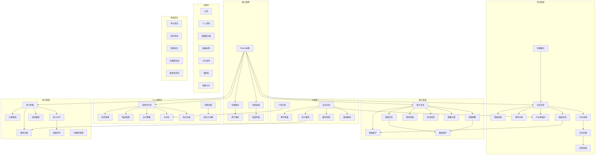

# EchoMind 应用开发任务清单

## 1. 核心功能任务

### 1.1 日记系统

| 任务 ID | 任务描述 | 优先级 | 估计工时 | 状态 | 依赖项 |
|---------|---------|--------|----------|------|--------|
| D-001 | 实现日记记录向导界面(DiaryWizardScreen) | 高 | 8h | [ ] | - |
| D-002 | 实现情绪选择与强度评级功能 | 高 | 4h | [ ] | D-001 |
| D-003 | 实现事件与想法记录界面 | 高 | 4h | [ ] | D-001 |
| D-004 | 集成思维扭曲识别功能 | 中 | 6h | [ ] | D-001 |
| D-005 | 实现AI分析结果展示界面 | 高 | 6h | [ ] | D-001, AI-001 |
| D-006 | 开发日记详情页面(DiaryDetailScreen) | 高 | 6h | [ ] | D-001 |
| D-007 | 实现日记列表页面(DiaryListScreen)与筛选功能 | 高 | 8h | [ ] | D-006 |
| D-008 | 开发日记数据本地存储服务 | 高 | 8h | [ ] | - |
| D-009 | 实现日记标签系统与搜索功能 | 中 | 4h | [ ] | D-007 |

### 1.2 数据统计与可视化

| 任务 ID | 任务描述 | 优先级 | 估计工时 | 状态 | 依赖项 |
|---------|---------|--------|----------|------|--------|
| S-001 | 开发统计主页面(StatsScreen) | 高 | 8h | [ ] | - |
| S-002 | 实现情绪分布饼图 | 高 | 6h | [ ] | S-001 |
| S-003 | 实现情绪趋势折线图 | 高 | 6h | [ ] | S-001 |
| S-004 | 实现思维扭曲类型柱状图 | 中 | 4h | [ ] | S-001, D-004 |
| S-005 | 开发记录频率热图 | 中 | 6h | [ ] | S-001 |
| S-006 | 实现时间范围选择器(日/周/月/年) | 高 | 4h | [ ] | S-001 |
| S-007 | 实现数据计算与聚合逻辑 | 高 | 8h | [ ] | S-001 |
| S-008 | 开发可复用图表组件(StatsChart) | 高 | 6h | [ ] | S-002, S-003 |

### 1.3 个人说明书系统

| 任务 ID | 任务描述 | 优先级 | 估计工时 | 状态 | 依赖项 |
|---------|---------|--------|----------|------|--------|
| P-001 | 开发个人说明书主页面(PersonalProfileScreen) | 高 | 8h | [ ] | - |
| P-002 | 实现优势与挑战管理功能 | 高 | 6h | [ ] | P-001 |
| P-003 | 开发触发因素记录功能 | 中 | 4h | [ ] | P-001 |
| P-004 | 实现应对策略库管理 | 中 | 6h | [ ] | P-001 |
| P-005 | 开发问答交互页面(QuestionAnswerScreen) | 高 | 8h | [ ] | - |
| P-006 | 实现自定义问题管理页面(CustomQuestionScreen) | 中 | 6h | [ ] | P-005 |
| P-007 | 集成AI个性化分析功能 | 高 | 6h | [ ] | P-001, AI-003 |
| P-008 | 开发个人说明书导出功能 | 低 | 4h | [ ] | P-001 |

### 1.4 AI分析系统

| 任务 ID | 任务描述 | 优先级 | 估计工时 | 状态 | 依赖项 |
|---------|---------|--------|----------|------|--------|
| AI-001 | 实现日记AI分析服务接口 | 高 | 8h | [ ] | - |
| AI-002 | 开发替代思维建议生成功能 | 高 | 6h | [ ] | AI-001 |
| AI-003 | 实现个性特征AI分析接口 | 高 | 6h | [ ] | - |
| AI-004 | 开发练习推荐算法 | 中 | 8h | [ ] | AI-001 |
| AI-005 | 实现AI分析结果本地缓存机制 | 中 | 4h | [ ] | AI-001 |
| AI-006 | 开发离线模式备选方案 | 中 | 8h | [ ] | AI-001 |

### 1.5 练习库系统

| 任务 ID | 任务描述 | 优先级 | 估计工时 | 状态 | 依赖项 |
|---------|---------|--------|----------|------|--------|
| E-001 | 开发练习列表页面(ExercisesScreen) | 高 | 8h | [ ] | - |
| E-002 | 实现练习分类与筛选功能 | 中 | 4h | [ ] | E-001 |
| E-003 | 开发练习详情卡片组件(ExerciseCard) | 高 | 6h | [ ] | E-001 |
| E-004 | 实现练习进度跟踪功能 | 高 | 6h | [ ] | E-001 |
| E-005 | 开发问题库管理页面(QuestionLibraryScreen) | 中 | 6h | [ ] | - |
| E-006 | 实现练习推荐展示功能 | 高 | 6h | [ ] | E-001, AI-004 |
| E-007 | 开发练习完成确认与效果评价功能 | 中 | 4h | [ ] | E-003 |

## 2. 基础设施任务

### 2.1 应用架构

| 任务 ID | 任务描述 | 优先级 | 估计工时 | 状态 | 依赖项 |
|---------|---------|--------|----------|------|--------|
| A-001 | 设置Redux Toolkit状态管理 | 高 | 8h | [ ] | - |
| A-002 | 实现导航结构与路由 | 高 | 8h | [ ] | - |
| A-003 | 开发主题系统与样式管理 | 高 | 6h | [ ] | - |
| A-004 | 实现本地存储服务(StorageService) | 高 | 8h | [ ] | - |
| A-005 | 设置国际化支持 | 中 | 6h | [ ] | - |
| A-006 | 实现用户偏好设置管理 | 中 | 4h | [ ] | A-004 |

### 2.2 UI组件开发

| 任务 ID | 任务描述 | 优先级 | 估计工时 | 状态 | 依赖项 |
|---------|---------|--------|----------|------|--------|
| UI-001 | 开发主页界面(HomeScreen) | 高 | 8h | [ ] | - |
| UI-002 | 实现个人资料页面(ProfileScreen) | 高 | 6h | [ ] | - |
| UI-003 | 开发底部导航组件 | 高 | 6h | [ ] | A-002 |
| UI-004 | 实现情绪指示器组件(EmotionIndicator) | 高 | 4h | [ ] | - |
| UI-005 | 开发扭曲标签组件(DistortionChip) | 中 | 4h | [ ] | - |
| UI-006 | 实现卡片组件(Card) | 高 | 4h | [ ] | - |
| UI-007 | 开发进度条组件(ProgressBar) | 中 | 4h | [ ] | - |
| UI-008 | 实现洞察卡片组件(InsightCard) | 中 | 4h | [ ] | - |

### 2.3 测试与优化

| 任务 ID | 任务描述 | 优先级 | 估计工时 | 状态 | 依赖项 |
|---------|---------|--------|----------|------|--------|
| T-001 | 编写核心业务逻辑单元测试 | 高 | 12h | [ ] | - |
| T-002 | 实现组件渲染测试 | 中 | 8h | [ ] | - |
| T-003 | 进行性能优化 | 中 | 8h | [ ] | - |
| T-004 | 实现无障碍功能测试 | 低 | 6h | [ ] | - |
| T-005 | 进行跨平台兼容性测试 | 高 | 8h | [ ] | - |

## 3. 优先级分组

### 3.1 第一阶段（MVP核心功能）
- D-001, D-002, D-003, D-005, D-006, D-007, D-008
- S-001, S-002, S-003, S-006, S-007, S-008
- A-001, A-002, A-003, A-004
- UI-001, UI-002, UI-003, UI-004, UI-006
- AI-001, AI-002

### 3.2 第二阶段（增强功能）
- P-001, P-002, P-005, P-007
- E-001, E-003, E-004, E-006
- D-004, D-009
- S-004, S-005
- A-005, A-006
- UI-005, UI-007, UI-008
- AI-003, AI-005
- T-001, T-002, T-005

### 3.3 第三阶段（完整功能）
- P-003, P-004, P-006, P-008
- E-002, E-005, E-007
- AI-004, AI-006
- T-003, T-004

## 4. 任务依赖关系图

